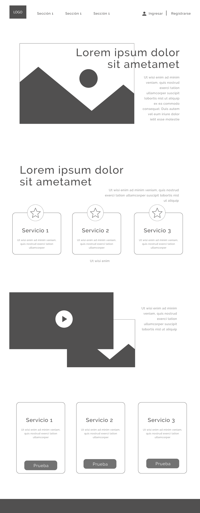
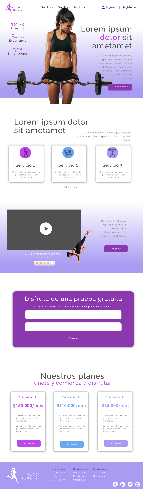

# Landing Fitness Health

## **Contenido**

- [1. De que se trata](#1-contexto)
- [3. Mockup](#2-Mockup)
- [2. Secciones](#3-secciones)

---

## 1. De que se trata

Hola, en este proyecto construí una landing page, cumpliendo con algunos requisitos y aplicando los conocimientos en html5, css y git, que he adquirido durante este primer módulo.

Uno de mis hobbies es el ejercicio, por lo cual decidí hacer una landing de una empresa que ofrece servicios de entrenamiento en tres categorías, musculación, pilates y zumba.

---

## 2. Mockup

Aquí puedes ver mis dos primeros bosquejos.

## 3. Secciones

La página cuenta con 7 secciones, el header, un main, 4 articles y el footer.

- **HEADER:** Aquí se encuentra en menú superior de la página, con su logo y las secciones principales, así como las opciones de ingreso y registro. Para la distribución del contenido Aplique flex.

- **MAIN:** En esta sección esta el jumbotron, quice poner una imagen por debajo de un texto, y quice usar la propiedad z-index en lugar de enviarla como fondo, entonces use posisiocnes absolutas para las etiquetas contenidas en el main, y z- index diferente para cada uno de estos.

- **ARTICLE:** En total hay cuatro articles así:

  - Servicios
  - Video
  - Formulario
  - Planes

  Cada uno de estos contiene diferente contenido, texto, imagenes, formulario, botones, etc. Para la distribución de todo estos use flex.

- **FOOTER:** Aquí agregue nuevamente el logo de la empresa, y enlaces a todas la secciones que tendría la página al final. Y finalmente la secciones de redes sociales, agregue los iconos como enlaces.
